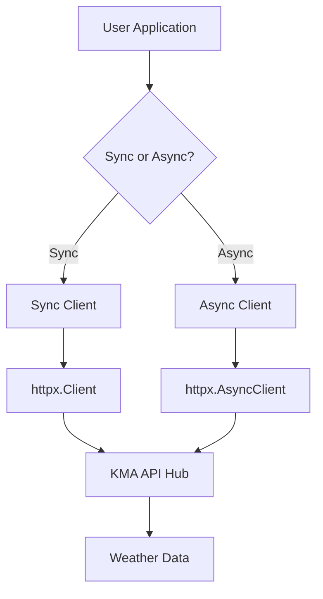

# Overview

kma-mcp is a Model Context Protocol (MCP) server that provides comprehensive access to the Korea Meteorological Administration (KMA) API Hub. It offers both synchronous and asynchronous Python clients for accessing real-time and historical Korean weather data.

## What is MCP?

The Model Context Protocol (MCP) is a standardized protocol for connecting AI assistants to external data sources and tools. kma-mcp implements this protocol to make Korean weather data easily accessible to AI models and applications.

## Architecture

### Client Architecture



### Project Organization

```
kma-mcp/
├── src/kma_mcp/
│   ├── surface/          # 10 Surface observation APIs
│   │   ├── asos_client.py
│   │   ├── aws_client.py
│   │   ├── climate_client.py
│   │   ├── dust_client.py
│   │   ├── nk_client.py
│   │   ├── snow_client.py
│   │   ├── uv_client.py
│   │   ├── aws_oa_client.py
│   │   ├── season_client.py
│   │   └── station_client.py
│   ├── marine/
│   │   └── buoy_client.py        # Marine buoy observations
│   ├── upper_air/
│   │   └── radiosonde_client.py  # Upper-air soundings
│   ├── radar/
│   │   └── radar_client.py       # Weather radar imagery
│   ├── satellite/
│   │   └── satellite_client.py   # GK2A satellite data
│   ├── earthquake/
│   │   └── earthquake_client.py  # Earthquake monitoring
│   ├── typhoon/
│   │   └── typhoon_client.py     # Typhoon tracking
│   ├── forecast/
│   │   ├── forecast_client.py    # Weather forecasts
│   │   └── warning_client.py     # Weather warnings
│   ├── global_met/
│   │   └── gts_client.py         # GTS worldwide data
│   ├── aviation/
│   │   └── amos_client.py        # Aviation weather
│   ├── integrated/
│   │   └── integrated_client.py  # Lightning, wind profiler
│   ├── utils/
│   │   └── weather_codes.py      # Korean weather utilities
│   └── mcp_server.py             # Main MCP server
└── tests/                         # 198 comprehensive tests
```

## Implementation Status

### Summary Statistics

| Metric | Value |
|--------|-------|
| **API Clients** | 21 implemented |
| **Total Clients** | 42 (21 sync + 21 async) |
| **Tests** | 198 (100% pass rate) |
| **Category Coverage** | 85% (11/13 categories) |

### Category Status

| Category | APIs | Status | Coverage |
|----------|------|--------|----------|
| **Surface Observations** | 10 | ✅ Complete | 100% |
| **Marine Observations** | 1 | ✅ Complete | 100% |
| **Upper-Air Observations** | 1 | ✅ Complete | 100% |
| **Radar** | 1 | ✅ Complete | 100% |
| **Satellite** | 1 | ✅ Complete | 100% |
| **Earthquakes** | 1 | ✅ Complete | 100% |
| **Typhoon** | 1 | ✅ Complete | 100% |
| **Forecasts & Warnings** | 2 | ✅ Complete | 100% |
| **Global Meteorology** | 1 | ✅ Complete | 100% |
| **Aviation Meteorology** | 1 | ✅ Complete | 100% |
| **Integrated Meteorology** | 1 | ✅ Complete | 100% |
| **Numerical Models** | 0 | ❌ Not available | 0% |
| **Industry-Specific** | 0 | ❌ Not available | 0% |

**Note**: Numerical Models and Industry-Specific APIs have no publicly accessible endpoints in KMA API Hub.

## Key Features

### 1. Dual Client Support

Every API has both synchronous and asynchronous implementations:

```python
# Synchronous version
from kma_mcp.surface.asos_client import ASOSClient

with ASOSClient(api_key) as client:
    data = client.get_hourly_data(tm='202501011200', stn=108)

# Asynchronous version
from kma_mcp.surface.async_asos_client import AsyncASOSClient

async with AsyncASOSClient(api_key) as client:
    data = await client.get_hourly_data(tm='202501011200', stn=108)
```

### 2. Context Manager Support

All clients support context managers for automatic resource cleanup:

```python
with ASOSClient(api_key) as client:
    # Client automatically closed on exit
    data = client.get_hourly_data(...)
```

### 3. Time Format Flexibility

Supports multiple time formats:

```python
# String format
data = client.get_hourly_data(tm='202501011200', stn=108)

# Python datetime
from datetime import datetime
data = client.get_hourly_data(tm=datetime(2025, 1, 1, 12, 0), stn=108)
```

### 4. Korean Weather Utilities

Special utilities for Korean weather data:

```python
from kma_mcp.utils.weather_codes import (
    wind_direction_kr,
    precipitation_type_kr,
    sky_condition_kr,
    enhance_weather_data,
    format_weather_summary
)

# Convert wind direction to Korean
direction = wind_direction_kr(270)  # "서풍"

# Enhance data with Korean fields
enhanced = enhance_weather_data(raw_data)

# Generate human-readable summary
summary = format_weather_summary(enhanced)
# "기온 15.2°C, 날씨 맑음, 풍향 서풍, 풍속 3.2m/s"
```

### 5. Comprehensive Error Handling

Proper HTTP error handling with descriptive messages:

```python
try:
    data = client.get_hourly_data(tm='202501011200', stn=108)
except httpx.HTTPStatusError as e:
    print(f"HTTP error: {e.response.status_code}")
except httpx.RequestError as e:
    print(f"Request failed: {e}")
```

## Data Coverage

### Temporal Coverage

| Data Type | Temporal Range | Update Frequency |
|-----------|----------------|------------------|
| **ASOS** | 1904-present | Hourly |
| **AWS** | 2000-present | 1-minute |
| **Climate Normals** | 1991-2020 | Static (30-year averages) |
| **Radar** | Recent 24h | 10 minutes |
| **Satellite** | Recent 24h | 10 min (full disk), 2 min (Korea) |
| **Forecasts** | +10 days | 6 hours |
| **Typhoon** | 1951-present | 3-6 hours (active) |
| **Earthquake** | Recent 30 days | Real-time |

### Spatial Coverage

| Category | Stations/Coverage |
|----------|-------------------|
| **ASOS** | 96 synoptic stations |
| **AWS** | ~600 automatic weather stations |
| **Marine Buoys** | Coastal waters + open seas |
| **Radar** | 10+ stations (national coverage) |
| **Satellite** | Full disk, Korea, East Asia regions |

## MCP Tools

The MCP server provides 55+ tools categorized by function:

### Surface Observations (32 tools)
- ASOS: 6 tools (current, hourly, daily, temperature, precipitation, stations)
- AWS: 4 tools (current, minutely, hourly, daily)
- Climate: 3 tools (daily, monthly, annual normals)
- Others: 19 tools (NK, dust, UV, snow, AWS-OA, season, stations)

### Marine & Upper-Air (6 tools)
- Marine buoys: 3 tools
- Radiosonde: 3 tools

### Imagery & Tracking (11 tools)
- Radar: 3 tools
- Satellite: 2 tools
- Typhoon: 4 tools
- Earthquake: 2 tools

### Forecasts & Global (16 tools)
- Forecasts/Warnings: 6 tools
- Global meteorology (GTS): 6 tools
- Aviation: 2 tools
- Integrated: 2 tools

## Development Principles

### Code Quality
- Type hints enforced by MyPy
- Comprehensive test coverage (198 tests)
- Ruff for linting and formatting
- Pre-commit hooks for code quality

### Documentation
- Detailed docstrings for all public APIs
- Usage examples in docs
- API status tracking in `API_STATUS.md`
- LLM-friendly documentation in `llms.txt`

### Testing Strategy
- Mock-based unit tests for all clients
- Context manager lifecycle tests
- Error handling tests
- Both sync and async test coverage

## Performance Considerations

### Synchronous vs Asynchronous

Use **sync clients** when:
- Making single, one-off requests
- Working in non-async codebases
- Debugging or prototyping

Use **async clients** when:
- Making multiple concurrent requests
- Building async web applications
- Maximizing throughput

### Rate Limiting

KMA API Hub has rate limits:
- **Free tier**: ~1000 requests/day
- **Premium tiers**: Higher limits available

Consider:
- Caching frequently accessed data
- Using batch requests where available
- Implementing exponential backoff for retries

## Technology Stack

| Component | Technology |
|-----------|-----------|
| **Language** | Python 3.13+ |
| **HTTP Client** | httpx (sync + async) |
| **MCP Framework** | FastMCP |
| **Package Manager** | uv |
| **Testing** | pytest |
| **Linting** | ruff |
| **Type Checking** | mypy |
| **Documentation** | MkDocs Material |

## Use Cases

### Research & Analysis
- Climate change studies using historical normals
- Extreme weather event analysis
- Air quality trends (PM10 yellow dust)
- Seasonal phenology research

### Operational Applications
- Real-time weather monitoring dashboards
- Aviation weather briefings
- Marine safety systems
- Agricultural decision support
- Public health alert systems (UV, air quality)

### AI & Machine Learning
- Weather forecasting models
- Climate prediction systems
- Anomaly detection
- Data preprocessing pipelines

## Next Steps

- [Getting Started](getting-started.md) - Installation and setup guide
- [API Categories](api-categories.md) - Detailed API documentation
- [API Reference](reference/) - Full API reference documentation
